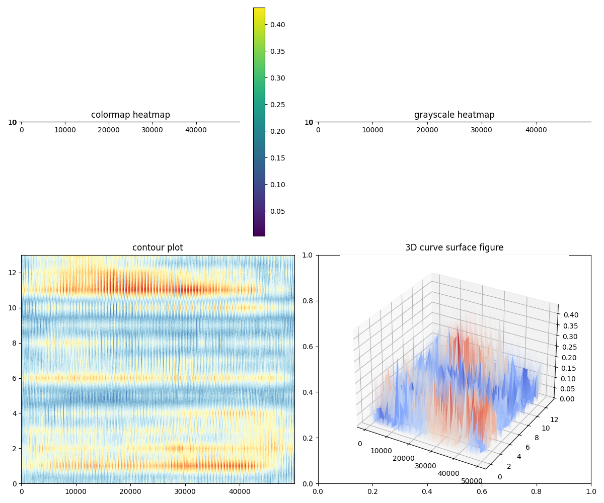

# 项目简介
本项目主要关注如何从原始的**若干被试者的全脑fMRI数据**中提取**特定voxel在不同的网络中的强度分布情况**。

数据转换与处理流程：

    n个被试 * 每个被试12个field情景* 每个情景（91 * 109 * 91 * 35 * 4）的fMRI原始数据
    ⬇️
    挑选12sub * 6个field/sub = 72个field的数据，并将每个field的5D数据整理成（91*109*91，35*4的形式）
    ⬇️
    对于90多万个voxel数据，在时序上过滤出方差较大的若干voxel，并从中随机挑选50000个voxel进行分析，最终获得72个（140，50000）的数据。
    ⬇️
    送入学习相关的规律分布。假定共有14个网络，最终由上面的数据得到一个共同的（14*50000）的矩阵Z，Z每一列代表一个voxel在14个网络上的分布。

具体的数学分析，参见项目中的/learn.md。
学习过程整体分成两个stage：
- stage1:一个线性分解，快速将X分解为SZ的矩阵乘积。
- stage2:引入变分自编码器VAE，在1的基础上适当微调。

最终呈现效果：



# 项目结构

```
.
├── data
│   └── 说明.txt
├── environment.yml
├── eval_split_half.py
├── expand_one_field.py
├── export_Z_from_ckpt.py
├── export.sh
├── inspect_one.py
├── inspect_small_dataset.py
├── learn.md
├── make_voxel_pick.py
├── output
│   ├── out_stage1_fast
│   ├── out_stage2_vae_from_fast
│   └── 说明.txt
├── README.md
├── stage2.sh
├── test.py
├── train_membershipfast1.py
├── train_stage2_vae.py
├── visualization_2d.png
├── visualization_col_barh.png
└── visualize_npy.py
```


# 使用顺序

```
# 1 根据YAML文件创建环境
conda env create -f environment.yml
```
```
# 2 检测：data中的.mat 文件内容结构，确认维度，方便后续读取
python inspect_one.py
```
```
# 3 检测：将 MATLAB 保存的单个 5D 数据恢复成 (V, T) 形状的 numpy 数组 其中 V 是体素数，T 是时间点数（4*35=140）。最终维度：(V, T)=(91*109*91, 140)= (902629, 140)
python expand_one_field.py
```
```
# 4 基于前3个被试的focus_clear字段，从90万多voxel数据中：1. 筛选出在所有3个被试中都有效（方差>1e-8）的体素 2. 从这些有效体素中随机选择5万个voxel 3. 保存其索引到voxel_pick.npy文件中，供后续使用，相当于保存的是voxel的索引
python make_voxel_pick.py
```
```
# 5 检验：计算每个sub的6个field的voxel time series数据的一些基本统计指标，使用之前生成的voxel_pick.npy来选取体素
python inspect_small_dataset.py
```
```
# 6 训练stage1：目标：尽快把共享 membership Z 分化出来（entropy 明显下降，z_usage 拉开），并避免 S(=encoder输出) 尺度爆炸导致“靠幅度拟合”。
# 在目前这套参数配置下，六七个epoch效果就可以了
# 需要先运行4获得voxel_pick.npy
python train_membershipfast1.py --amp
```
```
# 7 训练stage2：
# 需要指定接着训练的stage1的epoch。也是六七个效果就比较明显了。
bash stage2.sh
```
```
# 8 stage2如果要提前导出voxel_pick.npy和Z.npy
bash export.sh
# 但是需要提前指定好epoch。
```

```
# 9 分析结果可视化：
python visualize_npy.py
```
